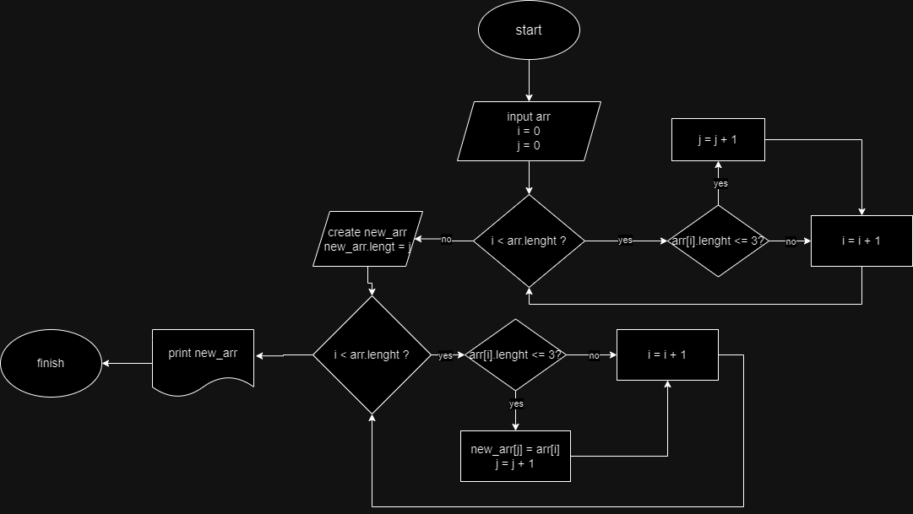

# Аттестация
## Описание
### __Делим задачу на отдельные методы:__
* Полученние данных
* Выборка
* Вывод
* Сам вызов всех методов

1. __Первым создаем метод, получающий данные от пользователя:__
количество элементов в массиве и сами элементы.
Тем самым создаем массив с выбранным кол-вом элементов и через цикл помещаем туда элементы написанные пользователем.
_(метод ничего не принимает, но возвращает созданный массив)_

2. __Второй метод отвечает за выбор нужных нам элементов:__
С помощью цикла проходимся по нашему массиву и делаем подсчет нужных элементов.
Дальше создаем новый массив с нужным количеством элементов, и с помощью еще одного цикла коппируем их туда.
_(этот метод берет массив с прошлого метода и возвращает новый массив с нужными нам элементами)_

3. __Третьем просто выводим наш конечный массив на консоль пользователю:__
Делаем это с помощью очередного цикла
_(принимает конечный массив и ничего не возвращает)_
 
4. __Вызываем все наши методы по порядку__

## Блок схема
